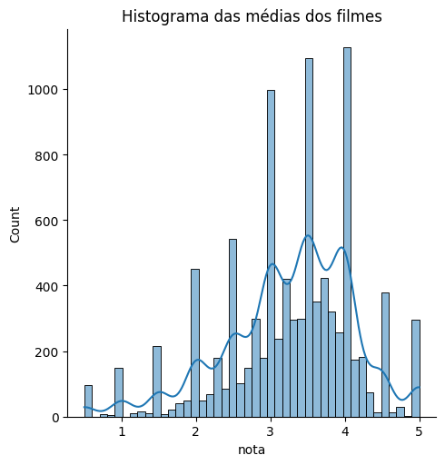
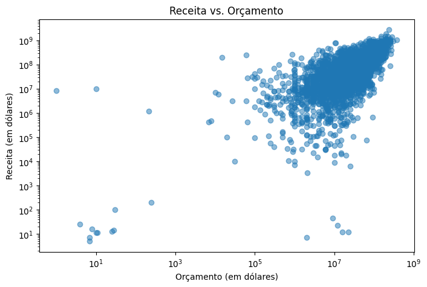
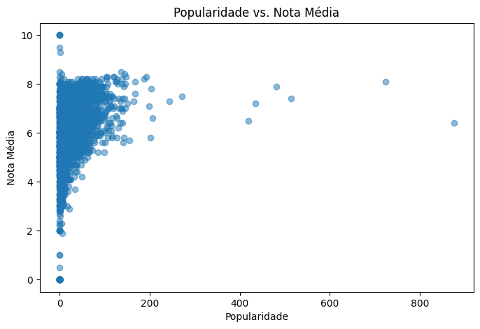

## Análise Comparativa de Bases de Dados de Filmes

### Resumo

Este estudo investiga três bases de dados relacionadas a filmes: avaliações de usuários, informações gerais de filmes e metadados detalhados do TMDB. A partir de metodologias estatísticas e cruzamento de dados, analisamos as características das avaliações, os gêneros mais frequentes, a popularidade dos filmes e os fatores que influenciam receita e desempenho crítico. Os resultados revelam tendências importantes em avaliações, preferências de gêneros, e a dinâmica entre popularidade, orçamento e receita, proporcionando uma base para estudos futuros.

### Metodologia

Foram utilizadas as seguintes bases:

1. **Ratings.csv**:
   - Contém avaliações de 100.836 usuários, com colunas `userId`, `movieId`, `rating` e `timestamp`. Esta base foi usada para identificar tendências de avaliação e comparar filmes.

2. **Movies.csv**:
   - Lista 9.742 filmes, identificados por `movieId`, com seus títulos e gêneros. Utilizada para identificar os gêneros mais frequentes e relacioná-los às avaliações.

3. **TMDB_5000_movies.csv**:
   - Oferece metadados detalhados de 4.803 filmes, incluindo orçamento, receita, popularidade, idioma, e votações. Usada para analisar o impacto de fatores financeiros e comerciais no desempenho de filmes.

As etapas de análise incluíram:
- Limpeza e padronização das bases, com renomeação de colunas e remoção de duplicatas.
- Consolidação das bases `Ratings` e `Movies` para explorar a relação entre avaliações e gêneros.
- Estatísticas descritivas e visualizações gráficas para identificar tendências e distribuições.
- Análise de correlações entre popularidade, receita e outros fatores.

### Resultados

#### Estatísticas Gerais
- **Avaliações**:
  - Nota média: 3.5 (desvio-padrão de 1.04), com maior concentração entre 3.0 e 4.0, indicando tendências moderadas de satisfação.
  - A menor nota é 0.5 e a maior é 5.0, mostrando uma ampla variação nas opiniões dos usuários.

- **Gêneros mais frequentes**:
  - Os gêneros mais comuns incluem Drama (1.053 ocorrências), Comédia (946) e combinações como Comédia|Drama (435). Isso reflete uma preferência geral por conteúdos dramáticos e leves.
  - Documentários também aparecem frequentemente (339), sugerindo um interesse significativo por filmes baseados em fatos.

#### Filmes mais bem avaliados
Os filmes com as maiores médias de avaliação foram:

| Título                                    | Nota Média | Número de Avaliações |
|-------------------------------------------|-------------|---------------------|
| Gena the Crocodile (1969)                 | 5.0         | 1                   |
| True Stories (1986)                       | 5.0         | 1                   |
| Cosmic Scrat-tastrophe (2015)             | 5.0         | 1                   |

Embora tenham as maiores notas, esses filmes possuem poucas avaliações, o que pode indicar viés amostral. Filmes com avaliações mais numerosas tendem a apresentar médias mais moderadas.

#### TMDB: Popularidade e Receita
- **Popularidade**:
  - Filme mais popular: "Minions" (875.58), seguido por "Interstellar" (724.25).
  - A popularidade tende a se correlacionar positivamente com orçamento elevado e ampla distribuição.

- **Orçamento e Receita**:
  - Orçamento médio: 29 milhões de dólares, com variação significativa (desvio-padrão de 40 milhões).
  - Receita média: 82 milhões de dólares, destacando que muitos filmes obtêm lucros consideráveis.
  - Filmes de orçamento elevado como "Avatar" tendem a liderar em receita e popularidade, embora nem sempre alcancem as melhores avaliações.

- **Qualidade vs. Popularidade**:
  - Filmes com alta popularidade não apresentam necessariamente as maiores notas médias, indicando que sucesso comercial e crítico nem sempre se alinham.

### Visualizações Gráficas

#### Distribuição das Avaliações

A distribuição das avaliações revelou que a maioria das notas está concentrada em torno de 3.5, com poucas avaliações extremas. Este gráfico reflete a satisfação moderada dos usuários:

#### Relação entre Receita e Orçamento

O gráfico a seguir demonstra a correlação entre o orçamento e a receita dos filmes. Filmes com orçamentos mais altos tendem a gerar maiores receitas, mas observa-se uma dispersão significativa, sugerindo que o sucesso comercial depende de múltiplos fatores:

#### Popularidade e Nota Média

Este gráfico contrasta a popularidade dos filmes com suas notas médias. Embora filmes populares como "Minions" liderem em visibilidade, suas notas médias não são excepcionalmente altas, reforçando a distinção entre sucesso comercial e qualidade percebida:

### Conclusões

1. **Preferências de Gêneros**: Drama e Comédia dominam em frequência, sugerindo que o público prioriza conteúdos emocionalmente envolventes e leves. Documentários também possuem uma demanda significativa.

2. **Dinâmica de Avaliações**: Notas concentradas entre 3.0 e 4.0 refletem uma satisfação moderada do público. Filmes com menos avaliações podem apresentar viés positivo.

3. **Fatores Comerciais**: Filmes com maiores orçamentos tendem a ter maior receita e popularidade, mas não necessariamente melhores avaliações, destacando a separação entre valor comercial e crítico.

4. **Popularidade vs. Qualidade**: O estudo reforça que filmes populares, como "Minions", alcançam ampla visibilidade, mas podem não ser considerados os melhores em qualidade pelo público.

As visualizações gráficas corroboram estas conclusões, proporcionando uma representação visual clara das tendências observadas nos dados. Este estudo fornece uma base sólida para futuras análises, como exploração de correlações entre gênero e performance financeira ou o impacto de estratégias de marketing na popularidade de filmes.

## Analisado por Diego Franco.